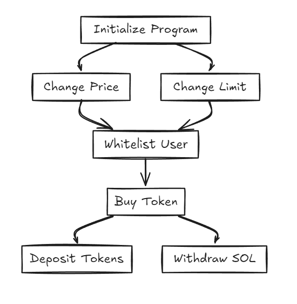

# Token Sale Program on Solana

This project implements a token sale system on the Solana blockchain using Rust and the Anchor framework. The system includes features like whitelisting, purchasing tokens, deposit and withdrawal functionality, and administration controls. The program is thoroughly tested using the Solana test validator and includes comprehensive unit tests.

## Architecture Diagram

The architecture of the token sale program is depicted in the diagram below:



## Table of Contents

- [Introduction](#introduction)
- [Installation](#installation)
- [Usage](#usage)
- [Program Overview](#program-overview)
  - [Program Functions](#program-functions)
  - [Test Functions](#test-functions)
- [Contributing](#contributing)
- [License](#license)

## Introduction

This repository contains a Solana token sale program built using the Anchor framework. The program allows an admin to initialize a token sale, whitelist users, manage token pricing, and handle deposits and withdrawals. Users can buy tokens if they are whitelisted and within their purchase limits.

## Installation

To get started with this project, clone the repository and install the necessary dependencies:

```bash
git clone https://github.com/Ragul8775/Token-Sale-Program-on-Solana.git
cd Token-Sale-Program-on-Solana
```

Ensure you have Rust, Anchor, and Solana CLI installed.

## Usage

To deploy and test the program:

1. Compile the program:

   ```bash
   anchor build
   ```

2. Deploy the program to the local validator or devnet:

   ```bash
   anchor deploy
   ```

3. Run the tests:
   ```bash
   anchor test
   ```

## Program Overview

### Program Functions

#### `initialize`

- **Description:** Initializes the configuration account, setting the token price, purchase limit, token mint, and admin public key.
- **Parameters:**
  - `token_price`: Price of the token in SOL.
  - `purchase_limit`: Maximum amount of tokens a user can purchase.
  - `admin_pubkey`: Public key of the admin.
- **Context Accounts:**
  - `config_account`: The configuration account.
  - `signer`: The admin who initializes the program.
  - `system_program`: Solana system program.
  - `token_mint`: The mint account for the token.
  - `token_account_owner_pda`: PDA for the token account owner.
  - `program_token_account`: The program's token account.
  - `token_program`: SPL Token program.
  - `associated_token_program`: SPL Associated Token program.

#### `change_price`

- **Description:** Allows the admin to change the price of the token.
- **Parameters:**
  - `new_price`: The new price of the token in SOL.
- **Context Accounts:**
  - `config_account`: The configuration account.
  - `signer`: The admin who changes the price.

#### `change_limit`

- **Description:** Allows the admin to change the purchase limit.
- **Parameters:**
  - `new_limit`: The new purchase limit.
- **Context Accounts:**
  - `config_account`: The configuration account.
  - `signer`: The admin who changes the limit.

#### `add_to_whitelist`

- **Description:** Adds a user to the whitelist, allowing them to purchase tokens.
- **Parameters:**
  - `pubkey_to_add`: The public key of the user to be whitelisted.
- **Context Accounts:**
  - `user_account`: The account representing the user.
  - `signer`: The admin who adds the user to the whitelist.
  - `config_account`: The configuration account.
  - `system_program`: Solana system program.

#### `remove_from_whitelist`

- **Description:** Removes a user from the whitelist, disallowing them from purchasing tokens.
- **Parameters:**
  - `pubkey_to_remove`: The public key of the user to be removed from the whitelist.
- **Context Accounts:**
  - `user_account`: The account representing the user.
  - `signer`: The admin who removes the user from the whitelist.
  - `config_account`: The configuration account.

#### `buy_token`

- **Description:** Allows a whitelisted user to purchase tokens within their purchase limit.
- **Parameters:**
  - `amount`: The amount of tokens to purchase.
- **Context Accounts:**
  - `signer`: The user who buys the tokens.
  - `user_account`: The account representing the user.
  - `user_ata`: The user's associated token account.
  - `config_account`: The configuration account.
  - `token_mint`: The mint account for the token.
  - `token_account_owner_pda`: PDA for the token account owner.
  - `program_token_account`: The program's token account.
  - `token_program`: SPL Token program.
  - `system_program`: Solana system program.
  - `associated_token_program`: SPL Associated Token program.

#### `deposit`

- **Description:** Allows the admin to deposit tokens into the program's token account.
- **Parameters:**
  - `amount`: The amount of tokens to deposit.
- **Context Accounts:**
  - `signer`: The admin who deposits the tokens.
  - `signer_ata`: The admin's associated token account.
  - `token_mint`: The mint account for the token.
  - `token_account_owner_pda`: PDA for the token account owner.
  - `program_token_account`: The program's token account.
  - `token_program`: SPL Token program.
  - `associated_token_program`: SPL Associated Token program.
  - `system_program`: Solana system program.

#### `withdraw`

- **Description:** Allows the admin to withdraw SOL from the program's account.
- **Parameters:**
  - `amount`: The amount of SOL to withdraw.
- **Context Accounts:**
  - `signer`: The admin who withdraws the SOL.
  - `config_account`: The configuration account.
  - `token_account_owner_pda`: PDA for the token account owner.
  - `system_program`: Solana system program.

### Test Functions

#### `Create token mint and mint some`

- **Description:** Initializes a token mint and mints tokens to the admin's associated token account.

#### `Initialisation`

- **Description:** Initializes the configuration account and sets the token price, purchase limit, and admin public key.

#### `Deposit`

- **Description:** Deposits tokens from the admin's associated token account into the program's token account.

#### `Buy without being whitelisted`

- **Description:** Attempts to buy tokens without being whitelisted, expecting failure.

#### `Whitelist`

- **Description:** Adds a random user to the whitelist.

#### `Buy being whitelisted`

- **Description:** Allows a whitelisted user to buy tokens and verifies the transfer.

#### `Admin withdraw SOL`

- **Description:** Allows the admin to withdraw SOL from the program's account.

You can generate an image from this Mermaid diagram and include it in the README.

## Contributing

Contributions are welcome! Please fork the repository, make your changes, and submit a pull request.

## License

This project is licensed under the MIT License - see the LICENSE file for details.
